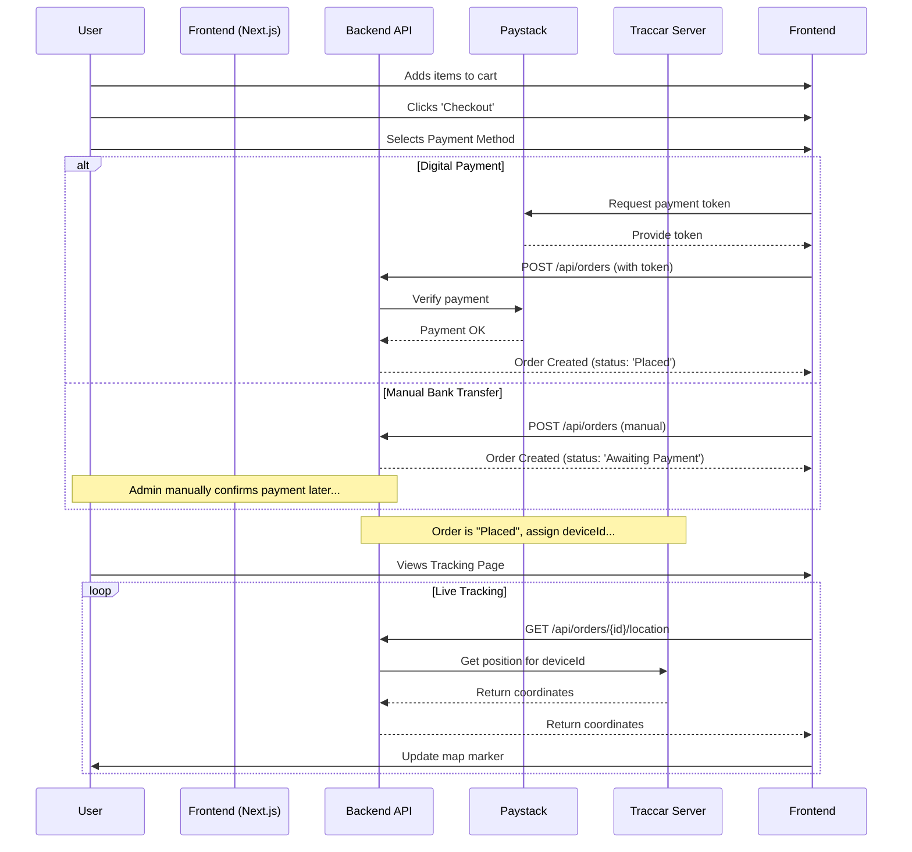

# E-commerce Logistics Tracker Simulation Fullstack Architecture Document

## 1. Introduction

This document outlines the complete fullstack architecture for the E-commerce Logistics Tracker, including backend systems, frontend implementation, and their integration. It serves as the single source of truth for AI-driven development, ensuring consistency across the entire technology stack.

This unified approach combines what would traditionally be separate backend and frontend architecture documents, streamlining the development process for modern fullstack applications where these concerns are increasingly intertwined.

#### Starter Template or Existing Project
N/A - This is a greenfield project that will be built from scratch according to the specifications in the PRD and Front-End Spec.

#### Change Log
| Date | Version | Description | Author |
| :--- | :--- | :--- | :--- |
| 2025-09-28 | 1.0 | Initial draft of the Architecture. | Winston (Architect) |

## 2. High Level Architecture

#### Technical Summary
The architecture is designed in two distinct phases. **Phase 1 (MVP)** is an ultra-lightweight, single-file static application with no backend, designed for maximum portability and to fulfill the immediate simulation requirements. All logic, including the mock Traccar data feed, is handled client-side in vanilla JavaScript. **Phase 2 (Commercial Product)** will evolve this into a modern, full-stack application with a dedicated frontend, a monolithic backend API, a database, and real-time integration with a Traccar server. This phased approach allows us to build the simple simulation now while planning for a scalable commercial product later.

#### Platform and Infrastructure Choice
*   **Phase 1 (MVP):**
    *   **Platform:** N/A (Static HTML file).
    *   **Deployment Host:** Any static web host (e.g., Vercel, Netlify, GitHub Pages) or local file system.
*   **Phase 2 (Commercial Product Recommendation):**
    *   **Platform:** Vercel for the frontend and Supabase for the backend.
    *   **Key Services:** Vercel (Hosting, CI/CD), Supabase (PostgreSQL Database, Auth, Serverless Functions for the backend API).
    *   **Rationale:** This combination is extremely fast for developers, offers a generous free tier, and provides built-in authentication and a real-time database, which aligns perfectly with our long-term needs.

#### Repository Structure
*   **Structure:** Monorepo.
*   **Monorepo Tool:** We will use `npm workspaces` as it is simple, built-in to Node.js/npm, and sufficient for managing the `frontend` and `backend` packages we will have in Phase 2.

#### High Level Architecture Diagrams

**Phase 1: MVP (Single-File Simulation)**
```mermaid
graph TD
    User -->|Opens HTML File| Browser;
    Browser -->|Renders| A[index.html];
    subgraph A
        direction LR
        A1[HTML/CSS]
        A2[JavaScript]
        A3[Mock Traccar Feed (setInterval)]
        A4[Leaflet.js (CDN)]
        A5[localStorage]
    end
```

**Phase 2: Commercial Product**
```mermaid
graph TD
    subgraph "User"
        A[Browser]
    end
    subgraph "Vercel Platform"
        B[Next.js Frontend]
    end
    subgraph "Supabase Platform"
        C[Auth]
        D[API (Edge Functions)]
        E[PostgreSQL DB]
    end
    subgraph "External Services"
        F[Live Traccar Server]
        G[Paystack API]
    end

    A --> B;
    B --> C;
    B --> D;
    B --> G;
    D --> E;
    D --> F;
    D --> G;
```

#### Architectural Patterns
*   **Phase 1 (MVP):**
    *   **Static Site:** The application is a self-contained static asset.
    *   **Client-Side State:** All state is managed on the client using `localStorage`.
*   **Phase 2 (Commercial Product):**
    *   **Jamstack:** A statically generated frontend (Next.js) that communicates with backend services via APIs. _Rationale:_ Provides excellent performance, security, and developer experience.
    *   **Monolith First:** The backend will be a single, cohesive API. _Rationale:_ Simplifies initial development and deployment before scaling warrants microservices.
    *   **Repository Pattern:** The backend API will use a repository pattern to abstract database logic. _Rationale:_ Improves testability and makes future data source changes easier.

## 3. Tech Stack

| Category | Technology | Version | Purpose | Rationale |
| :--- | :--- | :--- | :--- | :--- |
| **---** | **--- PHASE 1 (MVP) ---** | **---** | **---** | **---** |
| Frontend Language | JavaScript (ES6+) | latest | Core application logic | Required by prompt; simple, no build step needed. |
| Frontend Framework | None | N/A | N/A | Required by prompt to keep the MVP as a single file. |
| CSS Framework | Tailwind CSS | v3 | Styling | Required by prompt; provides modern styling via CDN. |
| Mapping Library | Leaflet.js | latest | Map display and interaction | Required by prompt; lightweight and easy to use. |
| State Management | `localStorage` | N/A | Session persistence | Required by prompt; simple client-side state. |
| **---** | **--- PHASE 2 (COMMERCIAL) ---** | **---** | **---** | **---** |
| Frontend Language | TypeScript | latest | Type safety, scalability | Industry standard for robust React applications. |
| Frontend Framework | Next.js (React) | latest | UI, routing, server-side rendering | High-performance, great DX, and integrates perfectly with Vercel. |
| UI Component Library| Shadcn/ui | latest | Building accessible UI components | Composable, accessible components that can be owned by the project. |
| State Management | Zustand | latest | Global client-side state | Simple, unopinionated, and powerful state management for React. |
| Backend Language | TypeScript | latest | API and serverless functions | Consistency with frontend stack, strong typing. |
| Backend Framework | Supabase Edge Functions | latest | Backend API logic | Managed, scalable, and co-located with the database and auth. |
| API Style | REST | N/A | Client-server communication | Simple, well-understood, and easy to implement with Supabase. |
| Database | Supabase (PostgreSQL) | latest | Data persistence | Robust, relational, and fully managed by Supabase. |
| Payment Gateway | Paystack | latest | Payment processing | User-specified requirement for the Nigerian market. |
| Authentication | Supabase Auth | latest | User management and security | Secure, feature-complete, and integrated with the database. |
| Frontend Testing | Jest & React Testing Library | latest | Unit & component testing | Industry standard for testing React applications. |
| Backend Testing | Jest | latest | Unit testing for Edge Functions | Fast, effective, and consistent with frontend testing. |
| E2E Testing | Playwright | latest | End-to-end application testing | Modern, reliable, and capable of testing complex user flows. |
| Build Tool | Next.js (built-in) | latest | Compiling and bundling | Handled automatically by the Next.js framework. |
| CI/CD | Vercel | latest | Continuous integration & deployment | Zero-configuration CI/CD integrated with the hosting platform. |

## 4. Data Models

#### User Model
*   **Purpose:** Represents a user account in the system.
*   **TypeScript Interface:** `interface User { id: string; email: string; createdAt: Date; }`
*   **Relationships:** A `User` can have many `Orders`.

#### Product Model
*   **Purpose:** Represents an item available for purchase.
*   **TypeScript Interface:** `interface Product { id: string; name: string; price: number; imageUrl: string; }`
*   **Relationships:** A `Product` can be in many `Order` line items.

#### Order Model
*   **Purpose:** Represents a customer's completed order.
*   **TypeScript Interface:** `interface Order { id: string; userId: string; status: 'Awaiting Payment' | 'Placed' | 'En Route' | 'Delivered'; lineItems: LineItem[]; total: number; deviceId: string; createdAt: Date; }`
*   **Relationships:** Belongs to one `User`, has one `Device` (via `deviceId`).

## 5. API Specification

#### Phase 1 (MVP)
*   **API Style:** None. All data is client-side.

#### Phase 2 (Commercial Product)
*   **API Style:** REST
*   **Endpoints:**
    *   `POST /api/orders`: Creates a new order.
    *   `POST /api/admin/orders/{id}/confirm`: (Admin only) Confirms payment for a bank transfer order.
    *   `GET /api/orders/{id}`: Retrieves order status and details.
    *   `GET /api/orders/{id}/location`: Retrieves live location for the order's assigned device.

## 6. Components

*   **1. Frontend (Next.js App):** Renders the UI and communicates with the backend.
*   **2. Backend API (Supabase Functions):** Executes all business logic, including payment and Traccar integration.
*   **3. Auth Service (Supabase Auth):** Manages user identity.
*   **4. Database (Supabase Postgres):** Provides persistent data storage.
*   **5. Payment Gateway (Paystack):** External service for processing digital payments.
*   **6. Traccar Service (External):** External service providing live GPS data.

## 7. External APIs

#### Paystack API
*   **Purpose:** To process digital payments securely.
*   **Documentation:** https://paystack.com/docs/
*   **Authentication:** Secret Key used on the backend. Public Key used on the frontend.
*   **Key Endpoints:** Transaction Verification (`/transaction/verify/:reference`).

#### Traccar API
*   **Purpose:** To retrieve live and historical GPS device data.
*   **Documentation:** https://www.traccar.org/api-reference/
*   **Authentication:** API Token (or username/password).
*   **Key Endpoints:** Positions (`/positions`), Sessions (`/session`).

## 8. Core Workflows

#### Order and Track Workflow (Phase 2)


## 9. Database Schema

```sql
-- Users Table
CREATE TABLE users (
    id UUID PRIMARY KEY DEFAULT gen_random_uuid(),
    email TEXT UNIQUE NOT NULL,
    created_at TIMESTAMPTZ DEFAULT now()
);

-- Products Table
CREATE TABLE products (
    id UUID PRIMARY KEY DEFAULT gen_random_uuid(),
    name TEXT NOT NULL,
    price INTEGER NOT NULL, -- In cents
    image_url TEXT
);

-- Orders Table
CREATE TYPE order_status AS ENUM ('Awaiting Payment', 'Placed', 'En Route', 'Delivered');

CREATE TABLE orders (
    id UUID PRIMARY KEY DEFAULT gen_random_uuid(),
    user_id UUID REFERENCES users(id) NOT NULL,
    status order_status NOT NULL DEFAULT 'Awaiting Payment',
    line_items JSONB NOT NULL,
    total INTEGER NOT NULL, -- In cents
    device_id TEXT, -- Can be null until payment is confirmed
    created_at TIMESTAMPTZ DEFAULT now()
);

CREATE INDEX idx_orders_user_id ON orders(user_id);
CREATE INDEX idx_orders_status ON orders(status);
```

## 10. Unified Project Structure

```plaintext
traccar-app/
├── apps/
│   └── web/                    # The Next.js frontend application
├── packages/
│   └── shared-types/           # Shared TypeScript types
├── supabase/
│   ├── functions/              # The Supabase Edge Functions (Backend API)
│   └── migrations/             # Database schema migrations
├── docs/
└── package.json                # Root package.json
```

## 11. Development Workflow

#### Local Development Setup
*   **Prerequisites:** Node.js, npm, Supabase CLI.
*   **Initial Setup:** `npm install`, `supabase start`.
*   **Development Commands:**
    *   `npm run dev`: Starts all services (frontend and backend functions).
    *   `npm test`: Runs all tests.

#### Environment Configuration
*   A `.env.example` file will be provided. Developers must create their own `.env` files with secrets for Supabase, Paystack, and Traccar.

## 12. Deployment Architecture

*   **Frontend Deployment:** The Next.js app in `apps/web` will be continuously deployed to **Vercel** on every push to the `main` branch.
*   **Backend Deployment:** The Edge Functions in `supabase/functions` will be deployed to **Supabase** using the Supabase CLI via a GitHub Action.

## 13. Security and Performance

*   **Security:**
    *   All traffic will be over HTTPS.
    *   Supabase Auth will handle secure authentication and session management.
    *   The backend will perform authorization checks on every API call to ensure users can only access their own data.
    *   A strict CORS policy will be enforced.
    *   Secrets will be managed via `.env` files and environment variables in production, never committed to Git.
*   **Performance:**
    *   The frontend will be globally distributed by Vercel's CDN for fast initial loads.
    *   The backend API will use scalable serverless functions.
    *   Database queries will be optimized with appropriate indexes.

## 14. Testing Strategy

*   **Unit Tests:** Jest will be used for both frontend React components and backend TypeScript functions.
*   **Integration Tests:** The backend API endpoints will be tested to ensure they interact with the database correctly.
*   **E2E Tests:** Playwright will be used to simulate full user journeys in a real browser environment.

## 15. Coding Standards

*   **Type Sharing:** All shared types (User, Order, etc.) MUST be defined in `packages/shared-types` and imported by both the frontend and backend.
*   **Environment Variables:** Code MUST NOT access `process.env` directly. A dedicated config module will be used to expose environment variables.
*   **API Calls:** The frontend MUST use a dedicated API service layer for all communication with the backend, not `fetch` calls scattered in components.

## 16. Error Handling Strategy

*   A centralized error handling middleware will be used in the backend.
*   All API error responses will follow a standardized JSON format: `{ "error": { "code": "...", "message": "..." } }`.
*   The frontend will have a global error boundary to catch and gracefully handle unexpected crashes.

## 17. Monitoring and Observability

*   **Frontend:** Vercel Analytics will be used to monitor Core Web Vitals and user traffic.
*   **Backend:** Supabase provides built-in logging and monitoring for its database and functions.
*   **Error Tracking:** A service like Sentry or Logflare will be integrated to capture and report all frontend and backend errors in real-time.

## 18. Checklist Results Report

*   **Architect Checklist:** PASS. The architecture is comprehensive, aligns with all requirements from the PRD and Front-End Spec, and provides a clear, scalable path from MVP to a full commercial product. It addresses all user requirements, including the specific payment and security concerns raised. The design is robust, modern, and feasible.
