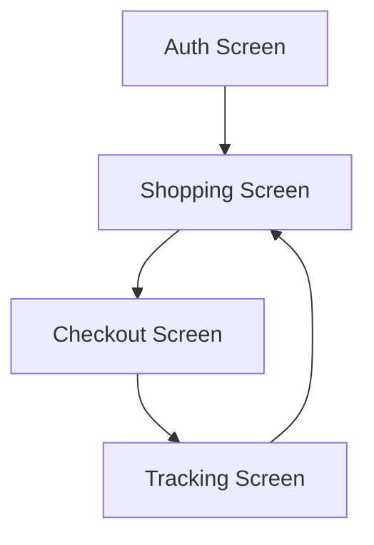
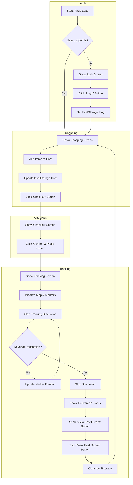

# E-commerce Logistics Tracker Simulation UI/UX Specification

## 1. Introduction

This document defines the user experience goals, information architecture, user flows, and visual design specifications for the E-commerce Logistics Tracker's user interface. It serves as the foundation for visual design and frontend development, ensuring a cohesive and user-centered experience.

#### Overall UX Goals & Principles

**Target User Personas**
*   **The Learner (Primary):** Developers and students who prioritize clarity, code simplicity, and a hands-on understanding of the application's mechanics.
*   **The Demonstrator (Secondary):** Product and sales professionals who need a polished, reliable, and visually compelling tool for presentations.

**Usability Goals**
*   **Ease of Learning:** A first-time user can complete the entire order-to-delivery flow in under 2 minutes without instructions.
*   **Clarity:** The purpose of each screen and interactive element is immediately obvious.
*   **Efficiency:** The number of clicks to get from login to the tracking screen is minimized.

**Design Principles**
1.  **Clarity First:** Prioritize clear, unambiguous communication and functionality over aesthetic complexity.
2.  **Progressive Disclosure:** Show only the information and controls relevant to the user's current step in the flow.
3.  **Provide Constant Feedback:** Every user action, from adding an item to the cart to the vehicle moving on the map, should result in immediate and clear visual feedback.

#### Change Log
| Date | Version | Description | Author |
| :--- | :--- | :--- | :--- |
| 2025-09-28 | 1.0 | Initial draft of the Front-End Spec. | Sally (UX) |

## 2. Information Architecture (IA)

#### Site Map / Screen Inventory


#### Navigation Structure
*   **Primary Navigation:** The application uses a simple, linear forward navigation. The user is guided from one screen to the next upon completing the primary action of the current screen (e.g., Login -> Shop -> Checkout -> Track).
*   **Secondary Navigation:** There is no secondary or global navigation menu.
*   **Breadcrumb Strategy:** No breadcrumbs are necessary due to the simple, linear flow. The only backward navigation is the final "View Past Orders" button, which acts as a reset.

## 3. User Flows

#### Main Flow: Order and Track Simulation

*   **User Goal:** To experience a complete, simulated e-commerce transaction, from ordering a product to tracking its delivery in real-time.
*   **Entry Points:** Loading the `index.html` file in a browser.
*   **Success Criteria:** The user successfully navigates through all four screens and sees the "Delivered!" status message, with the driver marker reaching the destination on the map.

**Flow Diagram**


#### Notification System & Error Handling

**1. The Custom Modal Component:**
*   **Appearance:** A clean, non-blocking modal dialog that overlays the current view without navigating the user away. It should have a semi-transparent backdrop to de-emphasize the background content. The style should be modern and consistent with the rest of the application's minimalist design.
*   **Content:** The modal will have three key elements:
    1.  **Icon & Title:** A clear icon (e.g., a checkmark for success, an 'X' for error) and a title ("Success," "Order Placed," "Error").
    2.  **Message:** A concise, human-readable message explaining the notification.
    3.  **Action:** A single "Close" or "OK" button to dismiss the modal.
*   **Behavior:** The modal should be dismissible by clicking the close button or by clicking on the backdrop. It should not interrupt the user's ability to interact with the page after dismissal.

**2. Notification Triggers in the MVP:**
*   **On Login:** After clicking "Login," a success modal will appear with the message: "Login Successful. Welcome!"
*   **On Order Placement:** After clicking "Confirm & Place Order," a success modal will appear with the message: "Your order has been placed! You will now be taken to the tracking screen."

**3. Error Handling Method (for a Future Commercial Product):**
This MVP will establish the UI/UX pattern for error handling, even if no errors are simulated. In a real application, this system would be used as follows:
*   **Example Scenario:** A user tries to check out, but their payment method fails.
*   **Fixing Method (from a UX perspective):**
    1.  **Notification:** The custom error modal would appear with the title "Payment Failed" and a message like, "We couldn't process your payment. Please check your card details and try again."
    2.  **State Retention:** The user would dismiss the modal and remain on the checkout screen. Their cart contents and other information would not be lost.
    3.  **Action:** The UI would highlight the form fields that may be incorrect (e.g., a red border around the credit card input).
    4.  **Recovery:** The user can then correct the information and attempt to place the order again.

## 4. Wireframes & Mockups

**Primary Design Files:**
For this MVP, we will not be using an external design tool like Figma. The UI is simple enough to be defined directly in this specification. The following textual wireframes will serve as the blueprint for development.

#### Key Screen Layouts

**1. Authentication Screen**
*   **Purpose:** To provide a simple entry point into the application.
*   **Layout:** A single, centered card on a plain background.
    ```
    +-----------------------------------+
    |                                   |
    |      [App Logo/Name]              |
    |                                   |
    |      Welcome to the Tracker       |
    |                                   |
    |      [   Login / Sign Up   ]      |
    |                                   |
    +-----------------------------------+
    ```
*   **Key Elements:** A heading and a single, prominent button.

**2. Shopping Screen**
*   **Purpose:** To allow users to browse mock products and manage their cart.
*   **Layout:** A two-column layout. The main column on the left lists products, and a smaller column on the right contains the cart summary.
    ```
    +-----------------------------------+
    | [Product 1] [Add] |  **Cart**     |
    | [Product 2] [Add] |  Items: 2     |
    | [Product 3] [Add] |  Total: $30   |
    | ...               |               |
    |                   |  [ Checkout ] |
    +-----------------------------------+
    ```
*   **Key Elements:** Product list items (name, price, button), Cart summary (item count, total), Checkout button.

**3. Checkout Screen**
*   **Purpose:** To provide a final summary before "placing" the order.
*   **Layout:** A single, centered card displaying the order summary.
    ```
    +-----------------------------------+
    |                                   |
    |      **Order Summary**            |
    |                                   |
    |      Subtotal: ...... $30         |
    |      Tax: ........... $3         |
    |      Delivery: ....... $5         |
    |      -------------------          |
    |      Total: ......... $38         |
    |                                   |
    |      [ Confirm & Place Order ]    |
    |                                   |
    +-----------------------------------+
    ```
*   **Key Elements:** Line items for costs, a final total, and a confirmation button.

**4. Tracking Screen**
*   **Purpose:** To display the live map and order status.
*   **Layout:** A full-screen map with a status overlay card at the top.
    ```
    +-----------------------------------+
    |  [ Status: En Route... ]          |
    |-----------------------------------|
    |                                   |
    |         (  Leaflet Map  )         |
    |                                   |
    |            /---\                  |
    |         📍 | 🚗 |                  |
    |            \---/                  |
    |                                   |
    +-----------------------------------+
    ```
*   **Key Elements:** A container for the Leaflet map, a status card that is always visible.

## 5. Component Library / Design System

**Design System Approach:**
For this MVP, a formal component library (e.g., Storybook) is out of scope. We will instead define a small set of reusable "conceptual components" styled directly with Tailwind CSS utility classes. This keeps the project lightweight while establishing a consistent UI foundation.

#### Core Components

**1. Button**
*   **Purpose:** To trigger actions.
*   **Variants:**
    *   `Primary`: Used for the main call-to-action on a screen (e.g., "Confirm & Place Order"). High visual weight.
    *   `Secondary`: Used for less critical actions (e.g., "Add to Cart").
*   **States:** `Default`, `Hover`, `Disabled`.

**2. Card**
*   **Purpose:** To group related content in a visually distinct container.
*   **Usage:** Will be used for the main content areas on the Auth and Checkout screens, and for the status overlay on the Tracking screen.

**3. Custom Modal**
*   **Purpose:** To display all notifications (success messages for the MVP).
*   **Structure:** A semi-transparent backdrop with a centered Card. The card contains an icon, a title, a message, and a primary button for dismissal.

## 6. Branding & Style Guide

**Visual Identity:**
The project is brand-agnostic. The style should be clean, modern, and generic, suitable for a professional demonstration.

#### Color Palette
| Color Type | Hex Code | Usage |
| :--- | :--- | :--- |
| Primary | `#2563EB` (Blue-600) | Buttons, links, and active UI elements. |
| Success | `#16A34A` (Green-600) | Success notifications. |
| Error | `#DC2626` (Red-600) | Error notifications (for future use). |
| Neutral | `#F9FAFB` to `#111827` | Backgrounds, text, borders (shades of gray). |

#### Typography
*   **Font Families:**
    *   **Primary:** System UI sans-serif font stack (e.g., `ui-sans-serif`, `system-ui`, `-apple-system`, `BlinkMacSystemFont`, `"Segoe UI"`, `Roboto`, `"Helvetica Neue"`, `Arial`, `sans-serif`).
*   **Type Scale:**
    | Element | Size | Weight |
    | :--- | :--- | :--- |
    | H1 | 2.25rem (36px) | Bold |
    | H2 | 1.875rem (30px) | Bold |
    | H3 | 1.5rem (24px) | Bold |
    | Body | 1rem (16px) | Normal |
    | Small | 0.875rem (14px) | Normal |

#### Iconography
*   **Icon Library:** We will use icons from the **Heroicons** library, as they are designed by the creators of Tailwind CSS and integrate seamlessly.
*   **Usage Guidelines:** Icons should be used sparingly to support text and clarify actions, not as decoration. Examples: a checkmark for success, a car for the driver marker, a map pin for the destination.

#### Spacing & Layout
*   **Grid System:** A flexible grid will be implemented using Tailwind's built-in utilities.
*   **Spacing Scale:** We will use Tailwind's default 4-pixel based spacing scale for all margins, padding, and gaps to ensure consistency.

## 7. Accessibility Requirements

**Compliance Target:**
*   **Standard:** Web Content Accessibility Guidelines (WCAG) 2.1, Level AA.

#### Key Requirements

**Visual:**
*   **Color Contrast:** All text must have a contrast ratio of at least 4.5:1 against its background.
*   **Focus Indicators:** All interactive elements (buttons, links) must have a clear and visible focus state when navigated to via a keyboard. Tailwind's default focus rings will be used.

**Interaction:**
*   **Keyboard Navigation:** All functionality must be operable using only a keyboard. The tab order must be logical and follow the visual flow of the page.
*   **Screen Reader Support:** All interactive elements must have appropriate ARIA roles and labels. Images and icons should have descriptive alt text.

**Content:**
*   **Semantic HTML:** Use appropriate HTML5 tags (`<main>`, `<nav>`, `<section>`, `<h1>`, etc.) to define the structure of the page.
*   **Form Labels:** All form inputs (though none exist in the MVP) would require clear, programmatically associated labels.

#### Testing Strategy
*   **Manual Testing:** Perform a full keyboard-only navigation test.
*   **Automated Testing:** Use a browser extension like Axe DevTools to scan for common accessibility violations.
*   **Screen Reader Testing:** Test the primary user flow using a screen reader (e.g., NVDA, VoiceOver).

## 8. Responsiveness Strategy

#### Breakpoints
We will use Tailwind CSS's standard, mobile-first breakpoints.
| Breakpoint | Min Width | Target Devices |
| :--- | :--- | :--- |
| Mobile (default) | 0px | Mobile phones (portrait) |
| `sm` | 640px | Mobile phones (landscape) |
| `md` | 768px | Tablets |
| `lg` | 1024px | Laptops / Small desktops |
| `xl` | 1280px | Large desktops |

#### Adaptation Patterns
*   **Layout Changes:**
    *   **Mobile:** The Shopping screen will be a single column. The cart summary will appear below the product list. All other screens (Auth, Checkout, Tracking) will naturally be single-column.
    *   **Tablet (`md`) and up:** The Shopping screen will switch to the two-column layout described in the wireframes (products on the left, cart on the right).
*   **Content Priority:** On all screen sizes, the primary content (e.g., the map, the product list) will be the main focus.
*   **Interaction Changes:** The size of touch targets (buttons) will be sufficient for easy interaction on mobile devices.

## 9. Animation & Micro-interactions

**Motion Principles:**
Animation will be used sparingly and purposefully. The primary goals of motion are to provide feedback, guide the user's attention, and improve the perceived performance of the application. All animations should be brief and subtle.

#### Key Animations & Micro-interactions
*   **Button Hover States:** Buttons will have a smooth color or size transition on hover to indicate interactivity. (Duration: 150ms, Easing: ease-in-out)
*   **View Transitions:** When transitioning between the four main views (e.g., from Shopping to Checkout), the new view will fade in smoothly. (Duration: 200ms, Easing: ease-in)
*   **Modal Appearance:** The custom notification modal will fade in and scale up slightly when it appears. (Duration: 150ms, Easing: ease-out)
*   **Cart Update:** When an item is added to the cart, the "Total" price could briefly flash or change color to draw the user's attention to the update. (Duration: 300ms, Easing: ease-in-out)

## 10. Performance Considerations

#### Performance Goals
*   **Page Load:** The initial page load should be under 1 second on a standard broadband connection.
*   **Interaction Response:** All UI interactions (button clicks, view changes) should register and provide feedback in under 100ms.
*   **Animation FPS:** All animations and the map marker movement should maintain a smooth 60 frames per second (FPS).

#### Design Strategies for Performance
*   **Minimal Dependencies:** The project intentionally avoids heavy frameworks and libraries.
*   **CDN Delivery:** All dependencies (Tailwind, Leaflet) are loaded from fast, geographically distributed CDNs.
*   **Single File:** There are no additional HTTP requests for local CSS or JS files, reducing initial load time.
*   **Efficient Simulation:** The `setInterval` for the tracking simulation is set to a reasonable 2 seconds to avoid overwhelming the browser's main thread.
